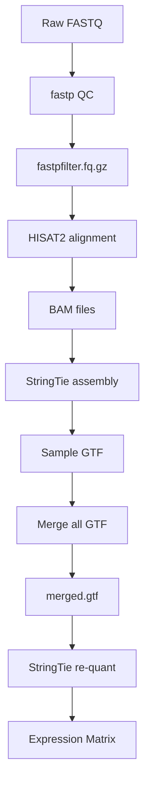

# RNA-seq Analysis Pipeline
# RNA-seq 分析流程

## Server Environment / 服务器环境

- **Server**: 69
- **Conda Environment**: `bioenv`
- **激活环境**: `conda activate bioenv`

---

## Software Versions / 软件版本
| Software | Version |
|----------|---------|
| fastp | v0.24.0 |
| HISAT2 | v2.2.1 |
| SAMtools | v1.21 |
| StringTie | v3.0.0 |
| Python | v3.8.20 |

---

## Analysis Workflow / 分析流程

## Step-by-Step Pipeline / 分步流程
Step 1: Quality Control (fastp) / 质控

Step 2: Read Alignment (HISAT2) / 序列比对

Step 3: BAM Processing (SAMtools) / BAM 处理

Step 4: Transcript Assembly (StringTie) / 转录本组装

Step 5: Merge Transcripts / 合并转录本

Step 6: Re-quantification / 重新定量

Step 7: Expression Matrix Construction / 表达矩阵构建

